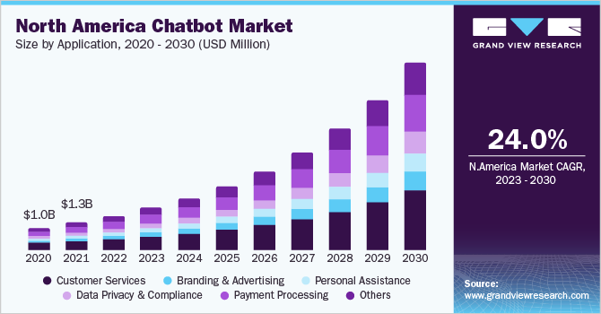
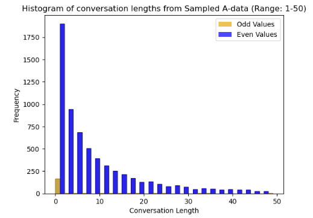
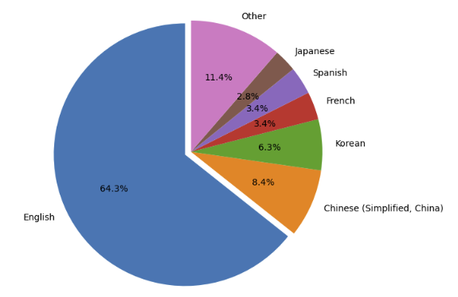
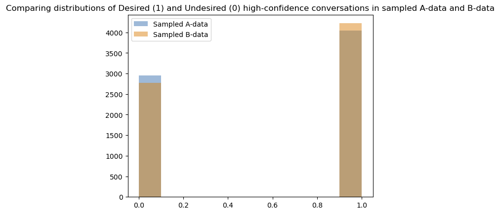
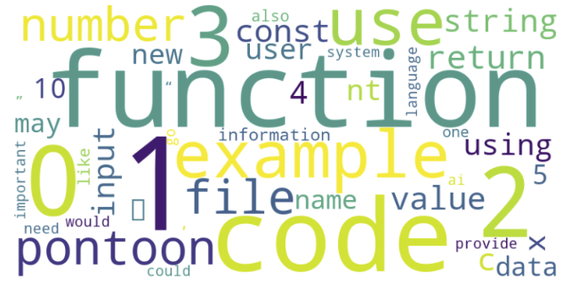

# Designing A/B experiment for Natural Language Bot upgrade

## Has new updates to my Natural Language Bot lead to more Customer Retention and Satisfaction? 

_Keywords_ - A/B testing, Hypothesis testing, NLP, Sentiment Analysis, Transformers, Linear Discriminant Analysis (LDA), ChatGPT, NLTK, Python, Pandas, Matplotlib  

### Context  

Natural Language Bots are becoming exponentially popular in enhancing customer experiences and improving business revenues, especially when _integrated on websites_ compared to traditional bots .  
However, quantitative studies are needed to understand the pain-points of customer interactions.  
Below chart from Grand View Research shows chatbot market projection in North America.  
The market is **expected to grow from ~1 billion dollar to ~25 billion dollars in a 10 year span from 2020 - 2030.**  

  

### Business Questions
1. Identify ways of quantifying customer experience via personalized chat bot interaction.  
2. Is staying on top of technology integration with current platforms _actually_ increasing business revenues?  
3. What are the pain-points in this exchange for future customizations and updates in the bot - drop-off topics, customer retention rate etc?  
4. Are new customizations leading to an expected positive impact (A/B testing)?  
5. Measure long-term impact on business ROI.  

### Data 
Real world use case would be a company's webpage with Natural Language Bot assisting in purchases.   
This interaction decides if a customer ends up buying a product or not (conversion rate)  

We will be using ChatGPT-3.5 and ChatGPT-4 conversation data for demonstration puposes  
We have conversation exchanges with ChatGPT from users across the globe collected over a period of - 
1. 6 months (Nov'22 - Apr'23, hereafter called **A-data**) - 52,000 conversations 
2. 3 months (Apr'23 - Jun'23, hereafter called **B-data**) - 40,000 conversations

This data is retrieved from shareGPT platform in json format with 3 columns - 

1. 'id', - unique id of a conversation exchange
2. 'from' - 'human' or 'gpt'
3. 'value' - natural language text of the interaction 

This study goes one step further on recently published work on this dataset (10th Dec 2023) - [Early ChatGPT User Portrait through the Lens of Data](https://arxiv.org/pdf/2312.10078.pdf)  
Authors found GPT to be POSITIVE (>80%), NEUTRAL (8%) and NEGATIVE (12%) even when given with negative prompts, suggesting overall positive tone of this Natural Language Bot.  

All the datasets used in the notebook could be found here - https://pitt-my.sharepoint.com/:f:/g/personal/yak39_pitt_edu/EvsVKJeRcnRAm82vqlrlrs8Bpj9ifBUwdzTAn0J0AVRMMw?e=wyT4Er 

### A/B testing (historic) 

1. We perform sentiment analysis on **A-data** and **B-data** to get the % of conversations with high-confidence positive user-experience (sentiment) before and after the bot upgrade.
2. We perform Power Analysis to get minimum number of samples required from both the datasets to have statistically significant results
3. We find that there is 2.5 % increase (57.8 % to 60.2 %) in % of high-confidence positive sentiment conversations.
4. This is statistically significant and as expected !
5. We also create WordCloud of high-confidence negative sentiment conversations and find that majority of the topics were related to programming, code, data and modeling.

### NOTE - 

1. In _real-time_ A/B testing, we would launch two different versions we want to test (A and B) SIMULTANEOUSLY to account for external factors like seasonality and monitor the results over SAME PERIOD OF TIME. 
2. For the sake of the study, we will assume that for A-data and B-data only thing that changes is the new upgrade to the bot (3.5 --> 4). To account for the newness of product, we took TWICE the period (6 months) for GPT-3.5 version than GPT-4 version (3 months). 
3. The shareGPT dataset might not be representative of the entire userbase
4. For e-commerce scenario, additional information like how long a session lasted AND how many users who visited the website ended up chatting with the bot and end up with certain _purchase_, we could quantify the quality of user engagement and its impact on revenue generation. 

**Users visiting website (100%) > Users interacting with chatbot (40%)  > Users performing desirable action (generating revenue)(10%)**

### Demo images (details in the notebook)
  
  
  
  

